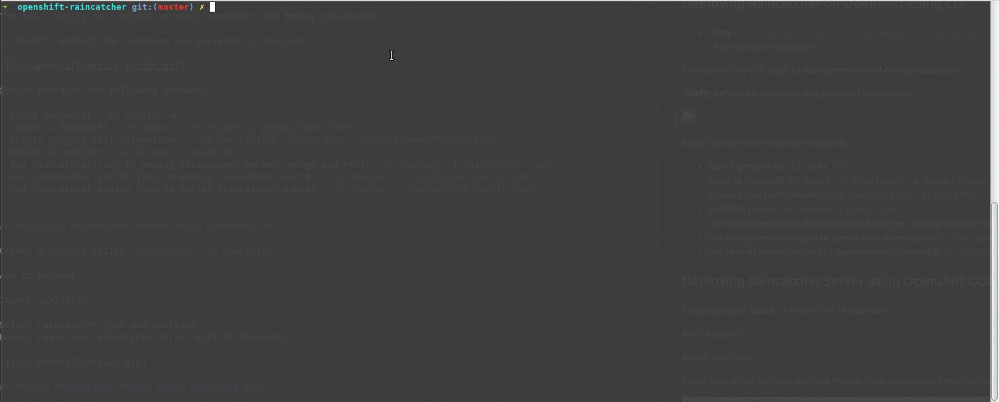

# Raincatcher Openshift Template

# Using this template

These templates are used to deploy RainCatcher to Openshift using the a s2i json files.

## Deploying Raincatcher on Openshift using CLI

- Clone https://github.com/feedhenry-raincatcher/openshift-raincatcher.git
- cd to openshift-raincatcher

The run ``deploy.sh`` script to start openshift and deploy raincatcher

|**NOTE**: default for username and password is developer 

Script contains the following commands

- Start Openshift ``oc cluster up``
- Login to Openshift ``oc login -u developer -p pasword-goes-here``
- Create project call raincatcher `` oc new-project raincatcher --display-name="Raincatcher"``
- Switch to project ``oc project raincatcher``
- Use raincatcher.json to deploy raincatcher-server, mongo and redis ``oc new-app -f raincatcher.json``
- Use raincatcher-portal.json to deploy raincatcher-portal ``oc new-app -f raincatcher-portal.json``
- Use raincatcher-mobile.json to deploy raincatcher-mobile ``oc new-app -f raincatcher-mobile.json``

## Deploying Raincatcher Server using Openshift GUI

Create a project called `raincatcher` in Openshift

Add to project

Import yaml/json

Select raincatcher.json and continue 
Mongo, redis and raincatcher-server will be deployed. 

## Deploy Raincatcher Portal using Openshift GUI

Select on 'Add to project'

Import yaml/json

Select raincatcher-portal.json and continue

once build use the follow link to access portal

http://raincatcher-portal-raincatcher.127.0.0.1.nip.io/?url=http://raincatcher-server-raincatcher.127.0.0.1.nip.io

## Deploy Raincatcher Mobile using Openshift GUI

This is a development environment only
Select on 'Add to project'

Import yaml/json

Select raincatcher-mobile.json and continue

once build use the follow link to access mobile

http://raincatcher-mobile-raincatcher.127.0.0.1.nip.io/?url=http://raincatcher-server-raincatcher.127.0.0.1.nip.io